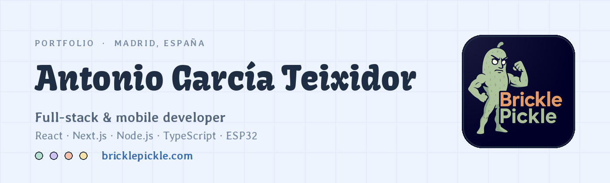
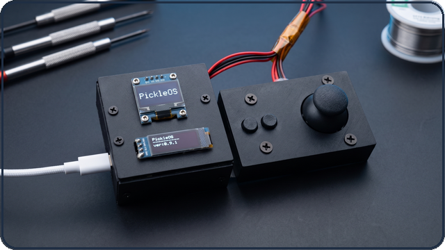
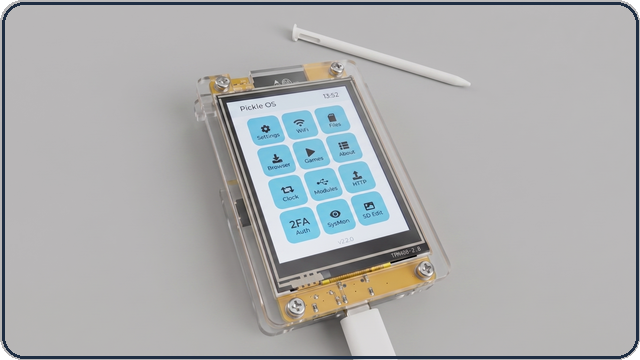
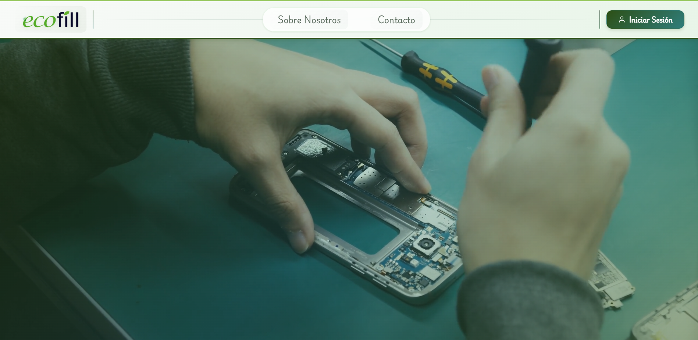
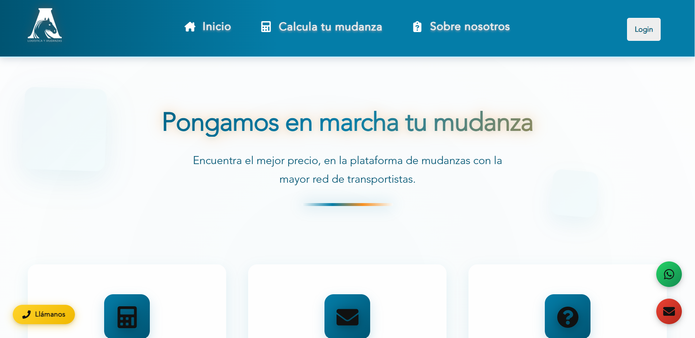

<picture>
  <source media="(prefers-color-scheme: dark)" srcset="assets/banner-dark.png">
  <source media="(prefers-color-scheme: light)" srcset="assets/banner-light.png">
  
</picture>

  
  
  
  

---

I build web applications with **React, Next.js and Node.js**, and I take the same projects all the way down to the metal: retro operating systems and tools for **ESP32** microcontrollers. Currently studying *Desarrollo de Aplicaciones Multiplataforma y Web* at IES Clara del Rey — dual programme, Madrid — while building things for real clients.

Construyo aplicaciones web con **React, Next.js y Node.js**, y llevo los mismos proyectos hasta el hardware: sistemas operativos retro y herramientas para microcontroladores **ESP32**. Estudio Desarrollo de Aplicaciones Multiplataforma y Web en el IES Clara del Rey — modalidad dual, Madrid — mientras desarrollo proyectos para clientes reales.

Away from the keyboard I teach chess, mostly to kids around twelve. Explaining why a move works turns out to be the same skill as explaining why a function does.

---

## Selected work · Proyectos destacados

<table>
<tr>
<td width="50%" valign="top">

<h3>Pickle OS</h3>

Retro-aesthetic operating system for the ESP32-C3. Dual OLED output, real-time file management and hardware control utilities.

<code>C</code> <code>MicroPython</code> <code>Lua</code> <code>ESP32</code>

<a href="https://bricklepickle.com/en/projects/pickle-os">Case study</a> · <a href="https://github.com/Brickle-Pickle/Pickle-OS">Repo</a>

</td>
<td width="50%" valign="top">

<h3>Pickle OS — GUI Edition</h3>

The same system rebuilt around a graphical interface, on hardware where every kilobyte of RAM has to be argued for.

<code>C</code> <code>MicroPython</code> <code>ESP32</code>

<a href="https://bricklepickle.com/en/projects/pickle-gui">Case study</a>

</td>
</tr>
<tr>
<td width="50%" valign="top">

<h3>Ecofill</h3>

Internal management platform: order scheduling, repairs, stock control and internal notes, plus an e-commerce gateway with its own admin panel and auth.

<code>React</code> <code>Vite</code> <code>Python · Flask</code> <code>SQL</code>

<a href="https://bricklepickle.com/en/projects/ecofill">Case study</a> · <a href="https://ecofill.es/">Live</a>

</td>
<td width="50%" valign="top">

<h3>Mudanzas Anderson</h3>

Integrated business management system for a moving company — quotes, scheduling and customer records in one place.

<code>React</code> <code>Node.js</code>

<a href="https://bricklepickle.com/en/projects/moves">Case study</a>

</td>
</tr>
</table>

  Every project written up properly — the problem, the decisions, what I got wrong — at
  <a href="https://bricklepickle.com/en/projects"><b>bricklepickle.com</b></a>
  · <a href="https://bricklepickle.com/es/projects">en español</a>

---

## Stack

**Web**

**Data**

**Embedded & systems**

**Also**

---

## Stats

  
  

  
  

---

## Right now · En qué ando

- Rebuilding **bricklepickle.com** in Next.js 16 — bilingual, statically generated, self-hosted on my own VPS
- Writing the ESP32 work up properly, so the case studies say more than "it blinks"
- Open to freelance: web apps, e-commerce and IoT — [services](https://bricklepickle.com/en/services) · [servicios](https://bricklepickle.com/es/services)

---

  <a href="https://bricklepickle.com"><b>bricklepickle.com</b></a> ·
  <a href="https://www.linkedin.com/in/antonio-gt/">LinkedIn</a> ·
  <a href="https://brickle-pickle.itch.io/">itch.io</a> ·
  <a href="mailto:info@bricklepickle.com">info@bricklepickle.com</a>

